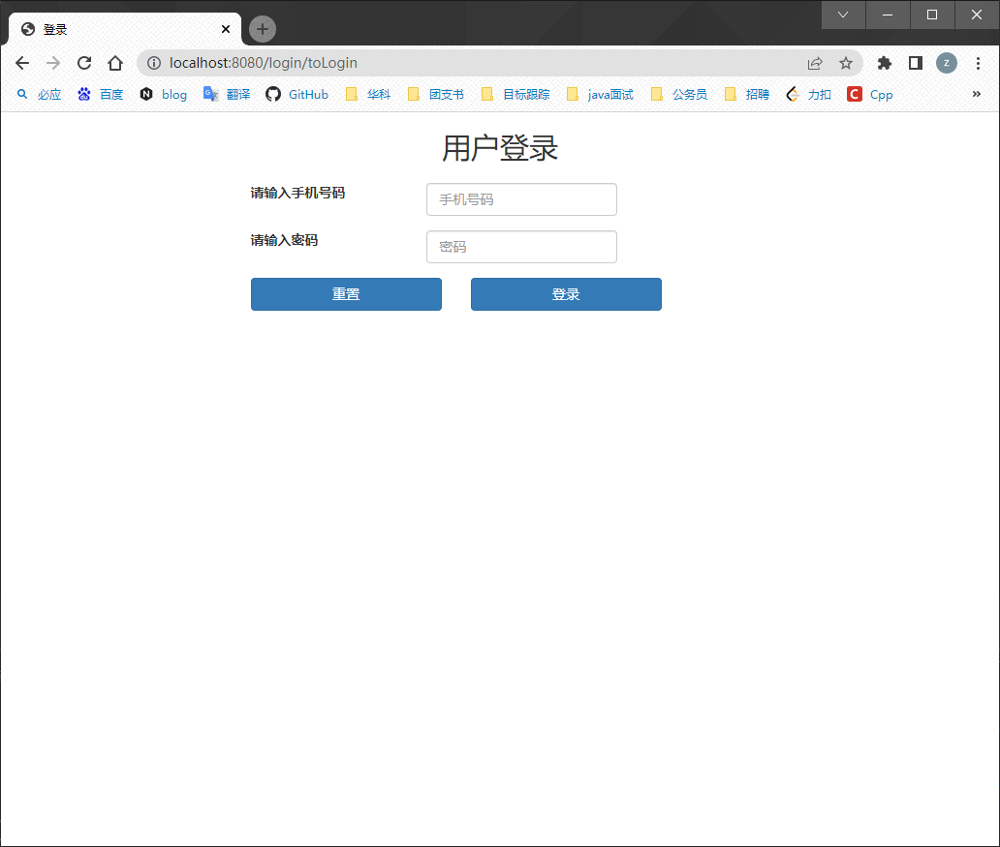
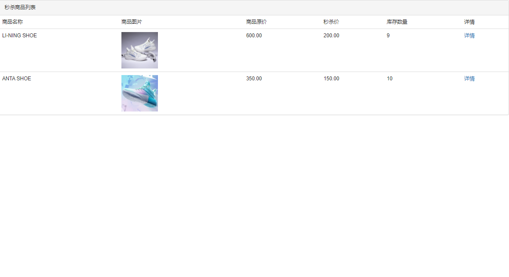
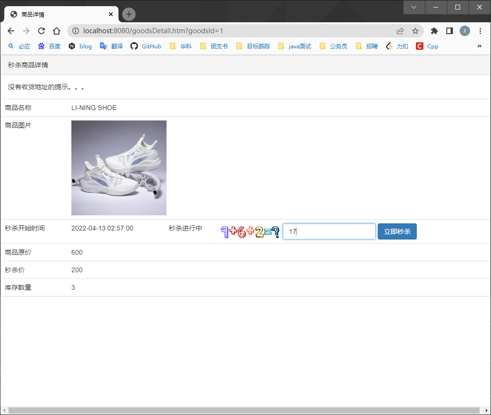
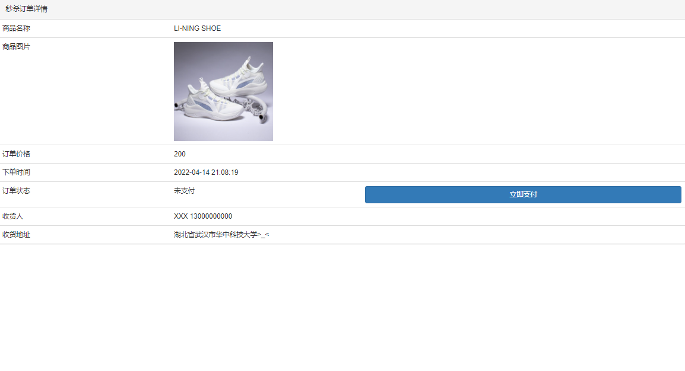

# seckill

## 项目介绍
这是一个商品秒杀系统，能够对高并发请求进行处理，实现了对多个用户同一时刻对同一件商品高效安全的秒杀。

## 技术要点
1. 使用SpringBoot + Mybatis_plus作为项目的整体框架
2. 实现了用户登录、商品展示、秒杀以及秒杀结果展示等功能
3. 数据库使用了Mysql存储用户以及商品信息
4. 使用Redis做缓存持久化存储session
5. 对页面进行静态化，使用ajax获取后端数据，实现前后端分离减少数据传输量。
6. 使用redis预减库存，预先加载库存在redis中，请求过来时先以原子形式减少库存来解决库存超卖问题
7. 在数据库中添加用户和商品的唯一索引以及使用Spring事务解决商品重复购买问题
8. 使用redis存储订单详情，较少查询数据库的次数
9. 使用RabbitMQ以Topic模式实现消息队列异步进行具体的秒杀逻辑，减少用户等待时间
10. 使用接口隐藏和验证码防止机器代抢
11. 通过设置请求计数器进行接口限流，限定规定时间的请求次数

## 结果展示
### 登录页面
这是用户登录页面，输入账号密码即可登录。

### 商品详情页
这是商品详情列表，列举所有商品的详细信息。

### 秒杀页面
这是秒杀页面，展示秒杀商品详情，通过输入验证码后点击秒杀按钮进行秒杀。

### 秒杀详情页
这是秒杀详情页，秒杀成功即可展示。

## 如何使用
1. 项目下载：https://github.com/wanzhiwen/seckill.git
2. 在IDEA中导入项目
3. 在自己的机器上安装mysql/rabbitmq/redis并启动
3. 在seckill/src/main/resources/application.yml中根据自己的环境更改配置
4. 向你的本机上导入数据库seckill/seckill.sql
6. 启动并在浏览器上输入http://ip_address:8080/login/toLogin开始秒杀！
