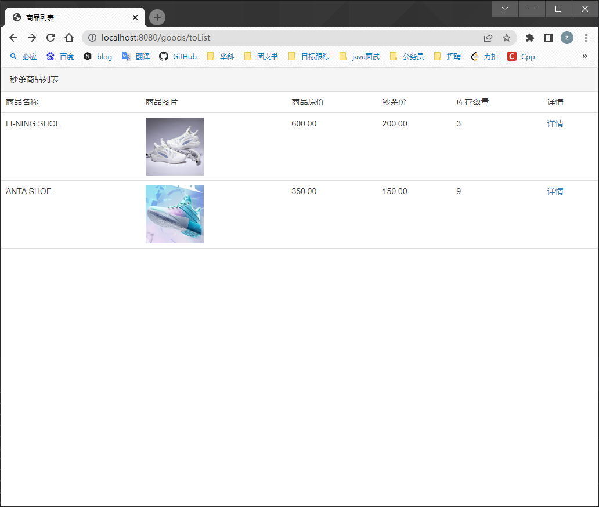

# seckill

## Introduction
This is a commodity seckill system, which can ensure that multiple people can purchase a commodity safely and effectively at the same time

## Technical points
TODO

## Display the results
### Login

### Goods Detail

### Seckill

### Seckill Success

## how to use
1. git clone https://github.com/wanzhiwen/seckill.git
2. open IDEA --> File --> New --> Open
3. install and start mysql/rabbitmq/redis in your machine
3. verify the settings in seckill/src/main/resources/application.yml to fit your machine
4. dump the seckill/seckill.sql to your local database
6. start the project and enter http://ip_address:8080/login/toLogin in your browser to start your seckill
